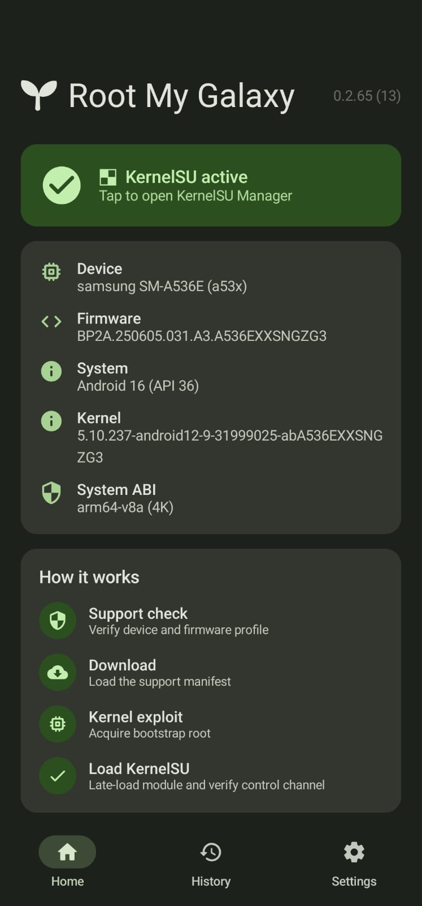
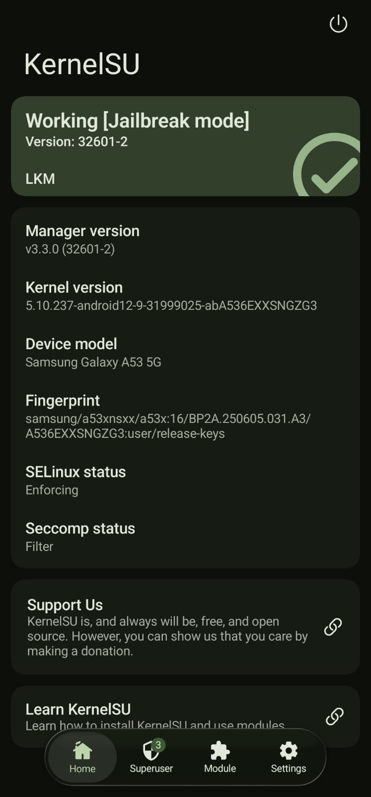

# SM-A536E A536EXXSNGZG3 validation

This profile was validated on a Galaxy A53 5G running the exact firmware and
kernel below.

| Field | Value |
| --- | --- |
| Model | `SM-A536E` |
| Device | `a53x` |
| Firmware | `A536EXXSNGZG3` |
| Android | 16 / API 36 |
| Page size | 4096 |
| Kernel | `5.10.237-android12-9-31999025-abA536EXXSNGZG3` |

The payload ran from the normal application domain
(`u:r:untrusted_app:s0`), found the KASLR slide with the CPU0-pinned prefetch
channel, found and reclaimed the target page with KernelSnitch, established
kernel read/write, and reached `ROOT_OK`. The runtime path uses neither
tracefs nor `perf_event_open`.

The exact KernelSU module was late-loaded on the same boot. KernelSU Manager
reported `Working <LKM> [Jailbreak mode]`, version `32525-2`. That was KernelSU
v3.2.5. The artifacts below are the v3.3.0 rebuild (`KSU_VERSION` 32601,
commit `932014ab5b2c9b74a3d11e2ec4d17dd10fc9442e`) with the same Samsung
KDP/RKP/DEFEX and no-patch-text source; they are build- and statically
verified but have not yet been re-loaded on hardware.

The production source is split by stage under
`src/targets/a53x-A536EXXSNGZG3/`: `payload.c` is the app entry point,
`ghostlock.c` provides the prefetch slide leak and 64-bit write,
`page.c` performs KernelSnitch discovery and deterministic SLUB/SKB reclaim,
and `chain.c` validates ARW, restores modified state, and starts the root
helper. It uses the repository's shared `src/kernelsnitch` code. Calibration,
perf, tracefs, oracle, and dry-run modes are not part of this payload.

The reclaim fix does not depend on the allocator's ambient partial-slab count.
After selecting a complete Normal-zone `mm_struct` slab, the payload allocates
24 slab-sized trigger batches (816 references) and a final rotation object on
CPU0. It frees one object from each trigger batch, keeps the other trigger
references alive, and frees the selected slab's last object only after that
drain pressure exists. The holder process keeps those references until ARW is
established, then normal process teardown releases them. DMA32 candidates are
skipped because they did not reclaim reliably into the SKB allocation path on
this device.

## Device evidence

| Root My Galaxy | KernelSU Manager |
| --- | --- |
|  |  |

## Published artifacts

| Artifact | Bytes | SHA-256 |
| --- | ---: | --- |
| `artifacts/a53x-A536EXXSNGZG3/cve-2026-43499-app.so` | 104128 | `fb9b2e08adb8046f3ae0566cc0b10ae55c5bb72b0d04396a935141e242060fdf` |
| `kernelsu/android12-5.10_kernelsu-A536EXXSNGZG3-kdp.ko` | 347432 | `c8a8ceb752c4b17140a1da3825549eb481d67e94f1283fd7a2f8ca24bcce77a4` |
| `kernelsu/ksud-A536EXXSNGZG3-kdp` | 5090760 | `10c395d7358e832d971ae93ec1adf6930ef41f5374ea3df0ea2b992b8c5aba0c` |

The superseded v3.2.5 pair (the device-tested one) was
`341368 / ae9d3815c69d708063a77c49470357f2b5b45ba7313cde6cebbf32ae05fa17a8`
for the module and
`4870752 / c35130bf54f7b8e3c31eee2349c7e053d1e2878b4d47b21090012523ff02e3ef`
for `ksud`. The v3.3.0 module inside the new `ksud` was verified byte-for-byte:
the embedded raw-deflate asset inflates to 347432 bytes with the module hash.

The v3.3.0 module has exact vermagic and a zero-length `__versions` section
(the manual-relocation loader contract). The audit against the target
`vmlinux` resolves all 168 undefined imports; the only difference from the
v3.2.5 module is the intended
`tracepoint_probe_register` -> `tracepoint_probe_register_prio` change.

The module has exact vermagic:

```text
5.10.237-android12-9-31999025-abA536EXXSNGZG3 SMP preempt mod_unload modversions aarch64
```

The result is a volatile LKM installation. A reboot removes KernelSU and the
bootstrap/late-load process must be run again. No boot image was flashed.

This profile is exact-build support; it does not claim compatibility with
other Galaxy A53 models, firmware, or kernel releases.
